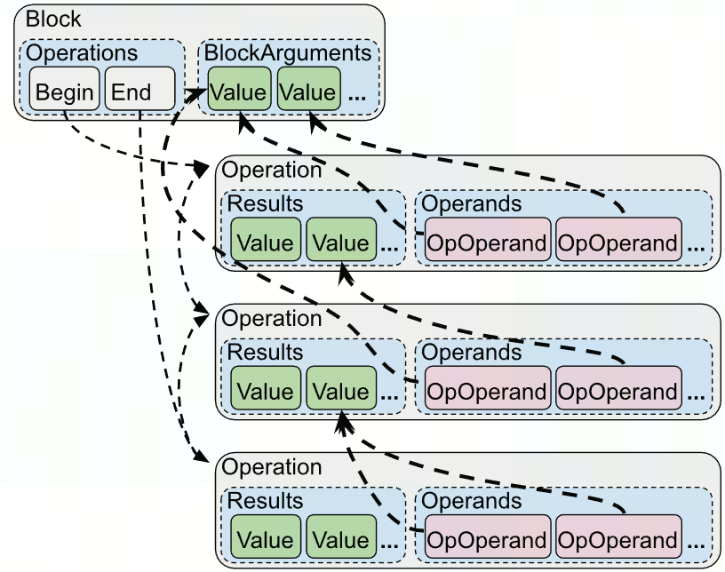

# [MLIR] Basic

```bash
# mac上编译mlir
mkdir build && cd build
cmake -G Ninja ../llvm \
   -DLLVM_ENABLE_PROJECTS=mlir \
   -DLLVM_TARGETS_TO_BUILD="host" \
   -DCMAKE_EXPORT_COMPILE_COMMANDS=ON \
   -DCMAKE_BUILD_TYPE=Release \
   -DLLVM_ENABLE_ASSERTIONS=ON \
   -DLLVM_ENABLE_RTTI=ON \
   -DLLVM_BUILD_EXAMPLES=ON

cmake --build . -- ${MAKEFLAGS} 
cmake --build . --target check-mlir

```

生成的compile_commands.json在 `llvm-project/build` 目录下，复制到llvm-project目录即可

配置vscode的clangd插件

ctrl + p 输入 clangd，先点击 下载language server；然后 加 settings.json , ctrl + p → '> 打开工作区设置json’

```cpp
{
    "clangd.arguments": [
        "--header-insertion=never",
        "--compile-commands-dir=${workspaceFolder}/",
        "--query-driver=**",
    ]
}
```

## Adaptor

只有operands没有results的中间态

ConversionPattern相比RewriterPattern多了一个adaptor

```cpp
struct AbsOpToMathAbsConverter : public OpConversionPattern<mhlo::AbsOp> {
  using OpConversionPattern<mhlo::AbsOp>::OpConversionPattern;
  LogicalResult
  matchAndRewrite(mhlo::AbsOp op, OpAdaptor adaptor,
                  PatternRewriter &rewriter) const final {
...
struct TransposeSliceLayoutPattern : public OpRewritePattern<mhlo::SliceOp> {
  using OpRewritePattern<mhlo::SliceOp>::OpRewritePattern;
  LogicalResult
  matchAndRewrite(mhlo::SliceOp op,
                  OpRewritePattern &rewriter) const override {
```

## Attribute

```jsx
llvm-project/mlir/include/mlir/IR/Attribute.h
```

常见类型：

- StringAttr
- UnitAttr / IntegerAttr / IndexAttr
- BoolAttr
- ArrayAttr
- DictionaryAttr

常用方法

使用 rewriter.getI64IntegerAttr或builder.getI64IntegerAttr可以创建这类Attr

- src: AttrTy
    - ::get()
      例如从SmallVector<Attribute>变成ArrayAttr
      
        ```cpp
        SmallVector<Attribute, 8> mappings;
        ArrayAttr tmp = ArrayAttr::get(context, mappings)
        ```
      
    - getName()
    - setValue()
    - getValue() 
    对于IntegertAttr会返回APInt，之后一般可以接 `getSExtValue()` ，来将APInt转为*int64_t*
- src : operation*
    - getAttr / getAttrOfType ，一般get完之后要cast到对应的AttrType，例如
    `op->getAttr(getAliasAttrKey()).dyn_cast_or_null<mlir::IntegerAttr>()`
    - hasAttr / hasAttrOfType
    - setAttr(StringRef name, Attribute value)
        - name可以`constexpr llvm::StringLiteral` 形式定义在头文件中
        - funcOp→setAttr(attrName, IntegerAttr::get(intType, 1));
    - removeAttr
    - func::FuncOp::setResultAttr

### operation、attribute、type关系

| 专用指针 | 通用指针 | 值 |
| --- | --- | --- |
| AddOp | Operation * | Operation |
| IntegerType | Type | TypeStorage |
| IntegerAttr | Attribute | AttributeStorage |

---

## Block

---

## Builder

```cpp
llvm-project/mlir/include/mlir/IR/Builders.h
llvm-project/mlir/lib/IR/Builders.cpp
```

`Builder` 用于创建新的 MLIR 操作

OpBuilder

---

## Bufferize

one-shot-bufferize

```jsx
llvm-project/mlir/lib/Dialect/Bufferization/IR/BufferizableOpInterface.cpp
```

1） OneShotBufferize pass (复制自前辈的笔记

对于每个有 `BufferizableOpInterface` 的op都进行bufferize

如果ir中存在某些

- 声明：llvm-project/mlir/include/mlir/Dialect/Bufferization/Transforms/Passes.td
    - 1. 先基于tensor的SSA use-def链进行原位分析来确认哪些operand可以in-place bufferize.（尽量减少alloc和copy, 提高性能）
        - destination-passing style op： 某一个operand和dst的buffer可复用，所以分配了该operand的buffer后，无需再分配dst的buffer：eg: %t0 = tensor.insert %f into %dest[%idx]， buffer(%t0)和buffer(%dest)是完全一致的；
        - 非destination-passing style op：对每个OpOperand产生一个新的buffer allocation, eg：tensor.generate
        - 所有新allocate的buffer后续都会deallocate，不然会内存泄露
    - 2.TensorCopyInsertion：对确定是out-of-place的operands插入 copies，insertTensorCopies()函数。
    - 3. 调用bufferize接口bufferize()函数来实现bufferize. bufferizeOp()函数。
    - 4. 函数签名的layout map由`function-boundary-type-conversion`选项单独控制，可选的参数有3种：`infer-layout-map`，`fully-dynamic-layout-map` and `identity-layout-map`， 默认是`infer-layout-map`。无法精确推测时，函数参数类型为fully dynamic layout maps。
    - 5.  `bufferize-function-boundaries` 是一个用来对funcOp、returnOp、callOp进行bufferize的flag
    - 6.funcArg一般可以bufferize，除非有 `bufferization.writable = false`
- 实现：llvm-project/mlir/lib/Dialect/Bufferization/Transforms/Bufferize.cpp
    - struct OneShotBufferizePass {void runOnOperation() override }
        - Configure type converter， 先获得 unknownTypeConversionOption：
            - 若是LayoutMapOption::IdentityLayoutMap， bufferization::getMemRefTypeWithStaticIdentityLayout(tensorType, memorySpace)；
            - 否则，只能是LayoutMapOption::FullyDynamicLayoutMap，bufferization::getMemRefTypeWithFullyDynamicLayout(tensorType,memorySpace);
        - Configure op filter. 依据编译选项设置不可bufferize的op
        - 依据编译选项是否激活bufferizeFunctionBoundaries确定调用哪个函数进行bufferize:
            - 若激活了，runOneShotModuleBufferize(moduleOp, opt, &statistics)
            - 反之，runOneShotBufferize(moduleOp, opt, &statistics)
        - createCanonicalizerPass()
        - createCSEPass()
        - createLoopInvariantCodeMotionPass()
- 示例：llvm-project/mlir/test/Dialect/Bufferization/Transforms/one-shot-module-bufferize-out-params.mlir, llvm-project/mlir/test/Dialect/Bufferization/Transforms/one-shot-module-bufferize.mlir

2) transform IR : transform.bufferization.one_shot_bufferize 有很多可选的参数

- layout{IdentityLayoutMap} { bufferize_function_boundaries = true }
- {bufferize_function_boundaries = true }
- 定义：llvm-project/mlir/include/mlir/Dialect/Bufferization/TransformOps/[BufferizationTransformOps.td](http://bufferizationtransformops.td/)
- 实现：transform.bufferization.one_shot_bufferize的代码：
    - llvm-project/mlir/lib/Dialect/Bufferization/TransformOps/BufferizationTransformOps.cpp: transform::OneShotBufferizeOp::apply()函数，从transform IR提供的各个参数中获得OneShotBufferizationOptions options，之后主要调用
        - runOneShotModuleBufferize()
            - insertTensorCopies(moduleOp, options)
            - bufferizeOp() 会调用`BufferizableOpInterface::bufferize()`函数来对每个op进行具体的bufferize
        - runOneShotBufferize()
            - insertTensorCopies(target, options)
            - bufferizeOp() 会调用`BufferizableOpInterface::bufferize()`函数来对每个op进行具体的bufferize
- 示例：llvm-project/mlir/test/Dialect/Bufferization/Transforms/transform-ops.mlir

```llvm
// 编译命令：mlir-opt --test-transform-dialect-interpreter
func.func @matmul(%A: tensor<12x9xf32>, %B: tensor<9x6xf32>, %C: tensor<12x6xf32>) -> tensor<12x6xf32> {
  %D = linalg.matmul ins(%A, %B: tensor<12x9xf32>, tensor<9x6xf32>) outs(%C: tensor<12x6xf32>) -> tensor<12x6xf32>
  return %D : tensor<12x6xf32>
}
// use identity layout at function boundaries.
transform.sequence failures(propagate) {
  ^bb0(%arg1: !pdl.operation):
  transform.bufferization.one_shot_bufferize layout{IdentityLayoutMap} %arg1 {bufferize_function_boundaries = true }
}
// result is 连续的memref
func.func @matmul(%arg0: memref<12x9xf32>, %arg1: memref<9x6xf32>, %arg2: memref<12x6xf32>) -> memref<12x6xf32> {
  linalg.matmul ins(%arg0, %arg1 : memref<12x9xf32>, memref<9x6xf32>) outs(%arg2 : memref<12x6xf32>)
  return %arg2 : memref<12x6xf32>
}
// use default at function boundaries.
transform.sequence failures(propagate) {
  ^bb0(%arg1: !pdl.operation):
  transform.bufferization.one_shot_bufferize %arg1 {bufferize_function_boundaries = true }
}
// result is 非连续的memref(所有func.func的args和返回值均是非连续的）
func.func @matmul(%arg0: memref<12x9xf32, strided<[?, ?], offset: ?>>, %arg1: memref<9x6xf32, strided<[?, ?], offset: ?>>, %arg2: memref<12x6xf32, strided<[?, ?], offset: ?>>) -> memref<12x6xf32, strided<[?, ?], offset: ?>> {
  linalg.matmul ins(%arg0, %arg1 : memref<12x9xf32, strided<[?, ?], offset: ?>>, memref<9x6xf32, strided<[?, ?], offset: ?>>) outs(%arg2 : memref<12x6xf32, strided<[?, ?], offset: ?>>)
  return %arg2 : memref<12x6xf32, strided<[?, ?], offset: ?>>
}
```

---

## DataType

```cpp
llvm-project/mlir/include/mlir/IR/BuiltinTypes.h
```

从ShapedType使用getElementType()获得

类型：

- FloatType
    - getF32
    - getWidth
- IndexType ：target word-size integer
- IntegerType

用法

- 判断类型
    - isInteger
    - isIndex
    - isIntOrIndex
    - isIntOrFloat
- 生成 get
    - RankedTenorType newType = RankedTensorType::get({srcDims[0], 1}), srcType.getElementType)
    - IntegerType::get(op→getContext(), 64);

---

## Dialect

### linalg

常用op

- linalg.fill
- linalg.map{ arith.op / math.op }
- linalg.matmul
- linalg.batch_matmul

### scf

常用op

- scf.for
- scf.foreach_thread / scf.parallel ： 循环body的程序是可以的并发执行，没有前后依赖的
  可以使用多线程的方式来执行，线程的id就是循环的迭代变量
  从scf到launch这种转换是可以通过代码自动完成的，需要的额外信息就是每一个循环的轴到launch的轴的映射关系
  
    ```llvm
    scf.foreach_thread (%thread_id_1, %thread_id_2) in
             (%num_threads_1, %num_thread_2) {      
             // ...                                       
          }                                                                        
        }
    ```
  

### tensor

```cpp
llvm-project/mlir/Dialect/Tensor/IR/Tensor.h
```

常用op

- tensor.empty

```cpp
auto srcShape = srcType.getShape();
SmallVector<int64_t> newShapes(srcShape.begin(), srcShape.end())
Value input = rewriter.create<tensor::EmptyOp>(loc, newShapes, srcType.getElementType());
// RankedTenorType newType = RankedTensorType::get({srcDims[0], 1}), srcType.getElementType)
```

- tensor.extract_slice [$offsets] [$sizes] [$strides]
    - getSource()
    - getResult()
    - getType() → getResult().getType()
- tensor.collapse_shape

```cpp

SmallVector<int64_t> srcDims;
RankedTensorType collapseType = RankedTensorType::get(srcDims, srcType.getElementType());
rewriter.create<tensor::CollapseShapeOp>(loc, collapseType, collapseIn, collapseIndices); // type, value, ArrayRef<ReassociationIndices>
```

- tensor.expend_shape

```cpp
// Convert the collapse into a 2-dimensional input into an input for [1, highDim, 1, lowDim], as linalg.pooling requires a 4-dimensional input.
RankedTensorType poolInputType = RankedTensorType::get({1, srcDims[0], 1, srcDims[1]}, srcType.getElementType());
SmallVector<ReassociationIndices> poolInputIndices = {{0, 1}, {2, 3}};
Value poolInput = rewriter.create<tensor::ExpandShapeOp>(loc, poolInputType, collapseOrExpand, poolInputIndices);
```

- 例如：transposeOp相关变换：
  
    ```cpp
    ///
    /// Pattern to fold transposeOp with one size dim.
    ///
    /// If some dimensions in the srcDims of transposeOp have a size of 1, we can
    /// fold it by a combination of tensor.collapse_shape and tensor.expand_shape.
    struct FoldTransposeWithOneSizeDims
        : public OpRewritePattern<linalg::TransposeOp> {
      using OpRewritePattern<linalg::TransposeOp>::OpRewritePattern;
      LogicalResult matchAndRewrite(linalg::TransposeOp op,
                                    PatternRewriter &rewriter) const override {
        if (!op.hasTensorSemantics()) {
          return failure();
        }
    
        Location loc = op->getLoc();
        auto permutation = op.getPermutation();
        auto src = op.getInput();
        auto dst = op.getInit();
        auto srcType = src.getType().dyn_cast<RankedTensorType>();
        auto dstType = op.getInit().getType().cast<RankedTensorType>();
    
        int64_t srcRank = srcType.getRank();
        auto srcShape = srcType.getShape();
    
        SmallVector<int64_t> oneSizeDimIndexs;
        DenseSet<int64_t> oneSizeDimIndexsSet;
        SmallVector<int64_t> oneSizeDimIndexsForDst;
        DenseSet<int64_t> oneSizeDimIndexsSetForDst;
        SmallVector<int64_t> leftIndexs;
        for (int64_t i = 0; i < permutation.size(); i++) {
          int64_t perm = permutation[i];
          if (srcShape[perm] == 1) {
            oneSizeDimIndexs.emplace_back(perm);
            oneSizeDimIndexsSet.insert(perm);
            oneSizeDimIndexsForDst.emplace_back(i);
            oneSizeDimIndexsSetForDst.insert(i);
            continue;
          }
          leftIndexs.emplace_back(permutation[i]);
        }
    
        // If none of srcDims has a size of 1, then we cannot fold.
        if (oneSizeDimIndexs.empty()) {
          return failure();
        }
    
        // Compute reassociations of collapseShapeOp and expandShapeOp.
        auto getReassociations = [&](const DenseSet<int64_t> &dimIndexSet)
            -> SmallVector<ReassociationIndices> {
          SmallVector<ReassociationIndices> reasso;
          ReassociationIndices currIndices;
          bool hadNoOneSize = false;
          bool hadOneSize = false;
          for (int64_t i = 0; i < srcRank; i++) {
            currIndices.emplace_back(i);
            if (dimIndexSet.count(i)) {
              hadOneSize = true;
            } else {
              hadNoOneSize = true;
            }
            // Split with the dimension of dimSize != 1.
            if (hadNoOneSize) {
              if (hadOneSize || i == srcRank - 1 || !dimIndexSet.count(i + 1)) {
                reasso.emplace_back(currIndices);
                currIndices.clear();
                hadNoOneSize = false;
                hadOneSize = false;
              }
            }
          }
          if (hadOneSize) {
            // Splice the last oneSizeDimIndexs to the last division of reasso.
            ReassociationIndices endIndices;
            if (!reasso.empty()) {
              endIndices = reasso.pop_back_val();
            }
            endIndices.append(currIndices.begin(), currIndices.end());
            reasso.emplace_back(endIndices);
          }
          return reasso;
        };
        auto collapseReasso = getReassociations(oneSizeDimIndexsSet);
        auto expandReasso = getReassociations(oneSizeDimIndexsSetForDst);
    
        // Compute resType of collapseShapeOp.
        SmallVector<int64_t> collapseResShape;
        llvm::for_each(collapseReasso, [&](const auto &shapeIndexs) {
          // The shapeIndexs contains the division of srcShape.
          // There is only one shapeIndex in each shapeIndexs that satisfies
          // srcShape[shapeIndex] != 1.
          if (shapeIndexs.size() == 1) {
            collapseResShape.emplace_back(srcShape[shapeIndexs[0]]);
          } else {
            auto it = llvm::find_if(shapeIndexs, [&](int64_t shapeIndex) {
              return !oneSizeDimIndexsSet.count(shapeIndex);
            });
            int64_t noOneSizeDimIndex = (it != shapeIndexs.end()) ? *it : -1;
            collapseResShape.emplace_back(
                (noOneSizeDimIndex == -1) ? 1 : srcShape[noOneSizeDimIndex]);
          }
        });
    
        RankedTensorType collapseType =
            RankedTensorType::get(collapseResShape, srcType.getElementType());
        Value collapseRes = rewriter.create<tensor::CollapseShapeOp>(
            loc, collapseType, src, collapseReasso);
    
        // When leftIndexs is not an increasing sequence, that is, the layout will
        // definitely change, then we need a new transposeOp after collapseShapeOp.
        Value expandIn = nullptr;
        auto isIncremental = [](llvm::ArrayRef<int64_t> array) {
            if (array.size() <= 1) {
                return true;
            }
            return llvm::all_of(llvm::zip(array, array.slice(1)),
                [](const auto &pair) {
              return std::get<0>(pair) <= std::get<1>(pair);
            });
        };
        
        if (!isIncremental(leftIndexs) && leftIndexs.size() > 1) {
          // Use the relative order of elements in leftIndexs to generate the
          // permutation of a new transposeOp.
          auto getNewPermutation = [](const SmallVector<int64_t> &relativeOrder)
              -> SmallVector<int64_t> {
            SmallVector<int64_t> sortOrder = relativeOrder;
            llvm::sort(sortOrder);
            SmallVector<int64_t> res;
            llvm::transform(relativeOrder, std::back_inserter(res),
                            [&](int64_t num) {
                              return llvm::find(sortOrder, num) - sortOrder.begin();
                            });
            return res;
          };
    
          SmallVector<int64_t> newPermutation = getNewPermutation(leftIndexs);
          Value transOut =
              rewriter.create<tensor::CollapseShapeOp>(loc, dst, expandReasso);
          auto transposedOp = rewriter.create<linalg::TransposeOp>(
              loc, collapseRes, transOut, newPermutation);
          expandIn = transposedOp.getResult()[0];
        }
    
        Value expandRes = rewriter.create<tensor::ExpandShapeOp>(
            loc, dstType, expandIn ? expandIn : collapseRes, expandReasso);
        rewriter.replaceOp(op, expandRes);
        return success();
      }
    };
    
    ```
    

### memref

- memref.view
    - getMixedOffsets / getMixedSizes / getMixedStrides → SmallVector<OpFoldResult>

---

## Conversion

形式：将写好的patten加入RewriterPatternSet并设置benefit，再apply

```cpp
	void runOnOperation() override {
		RewritePatternSet patterns(&getContext());
		patterns.add<xxxx>(patterns.getContext(), /*benefit*/2)
		if (failed(applyPatternsAndFoldGreedily(getOperation(), std::move(patterns))));
			return signalPassFailure();
	}
```

常见的apply形式:

- `applyPartialConversion` ：如果结果是合法（以`ConversionTarget`参数来判断）则保留，如果非法则报错
- `applyFullConversion` ：调用pattern对目标进行转换，直至IR满足`ConversionTarget`设置的目标合法
- `applyGreedilyConversion` ：尽可能地多次修改

前两种常用于dialect conversion，需要多传入一个`ConversionTarget`参数，greedilyConversion一般用于优化pass 

```cpp
MLIRContext &ctx = getContext();
ConversionTarget target(ctx);
target.addIllegalDialect<SparseTensorDialect>();
target.addLegalDialect
target.addLegalOp
target.addDynamicallyLegalOp

target.markUnknownOpDynamicallyLegal([](Operation *op) {
	if (isa<math::MathDialect>(op->getDialect()) &&
			llvm::isa<math::LogOp, math::ExpOp>(op)) {
	   return op->getResultTypes().front().isa<ShapedType>();
  }
  return true;
});

RewritePatternSet patterns(&ctx);
patterns.add<xxx>(patterns.getContext());
if(failed(applyParticalCpnversion(getOperation(), target,
																	std::move(patterns))))
	return signalPassFailure();
```

ConversionPattern相比RewriterPattern多了一个adaptor

```cpp
struct AbsOpToMathAbsConverter : public OpConversionPattern<mhlo::AbsOp> {
  using OpConversionPattern<mhlo::AbsOp>::OpConversionPattern;
  LogicalResult
  matchAndRewrite(mhlo::AbsOp op, OpAdaptor adaptor,
                  PatternRewriter &rewriter) const final {

// 
struct TransposeSliceLayoutPattern : public OpRewritePattern<mhlo::SliceOp> {
  using OpRewritePattern<mhlo::SliceOp>::OpRewritePattern;
  LogicalResult
  matchAndRewrite(mhlo::SliceOp op,
                  PatternRewriter &rewriter) const override {
```

---

## dialect conversion

即dialect_a中的op对应转换到dialect_b中，例如vector dialect → gpu dialect

dialect conversion一般包含op conversion和type conversion

### op conversion

1.OpRewritePattern

```cpp
mlir/include/mlir/IR/PatternMatch.h
```

以vector2gpu为例

```cpp
// mlir/lib/Conversion/VectorToGPU/VectorToGPU.cpp
// namespace内定义许多op rewrite patterns
namespace{
struct PrepareContractToGPUMMA:
		: public OpRewritePattern<vector::TransposeOp>{
	using OpRewritePattern<vector::TransposeOp>::OpRewritePattern;
	LogicalResult matchAndRewrite(vector::TransposeOp, 
																PatternRewriter &rewriter) const override{
	...
	}
}
...
void mlir::populateVectorToGPUConversionPattern(RewritePatternSet 
																															&patterns) {
	patterns.add<PrepareContractToGPUMMA>(patterns.getContext()); 
	// 可以设置pattern的/*benefit=*/
	// patterns.add<PrepareContractToGPUMMA>(patterns.getContext(), /*benefit=*/2); 
	...
}
} // namespace

namespace{
class ConvertVectorToGPUPass
	: public impl::ConvertVectorToGPUBase<ConvertVectorToGPUPass> {
	explicit ConvertVectorToGPUPass() = default; 

	void runOnOperation() override {
		RewritePatternSet patterns(&getContext());
		populateVectorToGPUConversionPattern(patterns);
		if (failed(applyPatternsAndFoldGreedily(getOperation(), std::move(patterns))));
			return signalPassFailure();
	}
};
} // namespace
std::unique_ptr<Pass> mlir::createConvertVectorToGPUPass(){
	return std::make_unique<ConvertVectorToGPUPass>();
}3
```

### type conversion

```cpp
llvm-project/mlir/Conversion/LLVMCommon/TypeConverter.h
```

对type对改写一般通过 `typeConverter` ，其一般包含三个功能

- `addConversion` ：定义type转换规则
- `addTargetMaterialization` ：sourceType→targetType
- `addSourceMaterialization` ：targetType→sourceType

```cpp
typeConverter converter;
converter.addConversion([&]ToyIntegerType t) -> std::optional<Integer> {
	return Integer::get(&getContext(), t.getWidth())
}
```

---

## Dataflow

MLIR中的数据流图是由Operation和Value构成的：（use-def chain）

- Value的值要么来自于Operation的result，要么来自于BlockArgument
    - 调用getDefiningOp时，BlockArguement会返回null
- 每个Operation的Operand都是到Value的指针

Operation都包含Results和Operands；Results中包含多个OpResult实例，Operands中包含多个OpOperand实例



- 修改Operand时，实际是修改OpOperand，对应value的use-chain也会被修改


### Operation找Value

- getOperands() / getResults()

```cpp
for (auto operand : op.getOperands()) {
	if (auto *def = op.getDefiningOp()) {
	} else {
		// BlockArguement
	}
}
```

- getOpOperands() 用于需要修改operand时

```cpp
IRMapping mapping;
mapping().map(op1.getResults(), op2.getResults());
for (auto &opOperand : op3.getOpOperands()) {
	// 将 op3 的参数里含有 op1 results 的替换为 op2 的
  // lookupOrDefault 指找不到 mapping 就用原来的
  opOperand.set(mapping.lookupOrDefault(opOperand.get()));
}
```

### value找op

- getDefiningOp：可能返回nul
- getUses ：返回OpOperand迭代器，即使用了这个value的OpOperand集合
OpOperand &operand : value.getUses()
- getUser ：返回Operation迭代器，即直接依赖于该value的operation集合
user_iterator相当于对use_iterator使用getOwner()
use.getOwner() → Operation*

---

## DialectConversion

```cpp
llvm-project/mlir/lib/Transforms/Utils/DialectConversion.cpp
```

Value ConversionValueMapping::lookupOrDefault(Value from, Type desiredType)

---

## DialectRegistry

The DialectRegistry maps a dialect namespace to a constructor for the matching dialect ：看起来像为dialect中的op外挂新的属性

```cpp
llvm-project/mlir/include/mlir/IR/DialectRegistry.h
```

例如为linalg的op挂上新的interface

```cpp
void mlir::xxx::utils::registerLinalgAggregatedOpInterfaceModel(
    DialectRegistry &registry) {
  registry.addExtension(+[](MLIRContext *ctx, LinalgDialect *dialect) {
    linalg::MapOp::attachInterface<MapOpInterface>(*ctx);
    MatmulOp::attachInterface<
        MatmulOpInterface<MatmulOp, linalg::Conv2DNhwcFhwcOp>>(*ctx);
    BatchMatmulOp::attachInterface<
        MatmulOpInterface<BatchMatmulOp, linalg_ext::BatchConv2DNhwcFhwcOp>>(
        *ctx);
    ReduceOp::attachInterface<ReduceOpInterface>(*ctx);
  });
}

// 定义上例如，其中AggregatedOpInterface需要在LinalgExtInterface.td定义
template <typename SrcOpTy, typename DstOpTy>
struct MatmulOpInterface : public AggregatedOpInterface::ExternalModel<
                               MatmulOpInterface<SrcOpTy, DstOpTy>, SrcOpTy> {
  FailureOr<SmallVector<Operation *>>
  decomposeOperation(Operation *op, Operation *value,
                     PatternRewriter &rewriter) const {
	}
};
```

---

## IRMapping

```cpp
llvm-project/mlir/include/mlir/IR/IRMapping.h
```

用法：

- 构造
    - map(Value from, Value to)
    - map(Block *from, Block *to)
    - map(Operation *from, Operation *to)
- lookupOrValue(from, value);
- lookupOrDefault 《=》 lookupOrValue(from, from);

```cpp
IRMapping mapping;
mapping().map(op1.getResults(), op2.getResults());
for (auto &opOperand : op3.getOpOperands()) {
	// 将 op3 的参数里含有 op1 results 的替换为 op2 的
  // lookupOrDefault 指找不到 mapping 就用原来的
  opOperand.set(mapping.lookupOrDefault(opOperand.get()));
}
```

- lookupOrNull 《=》 lookupOrValue(from, nullptr);

---

## Interface

- AttrInterface
    - ElementsAttrInterface
        - DenseIntOrFPElements
        - DenseStringElements
        - DenseResourceElements
        - SparseElements
    - MemRefLayoutAttrInterface
    - TypeAttrInterface
- **DestinationStyleOpInterface
linalOp都包含该interface**

```cpp
OpOperandVector getDpsInputOperands()
OpOperandVector getDpsInitOperands()
	其中每个元素为 `OpOperand *` ，使用opOperand->get()即可得到alue
```

- BufferizableOpInterface：在oneShotBufferize pass会对有该inferface的op进行bufferize
- TilingInterface：对于有该interface的op可以cast成该interface `llvm::cast<TilingInterface>(op)`
    - getLoopIteratorTypes：每个元素为utils::IteratorType，表示为utils::IteratorType::parallel或utils::IteratorType::reduction
    - getIterationDomain：每个元素是一个Range
      
        ```cpp
        if (auto intAttr = range.size.dyn_cast<Attribute>()) {
        	tileSize = std::min(adaptiveTileSize, intAttr.cast<IntegerAttr>().getInt());
        }
        ```
        

---

## llvm

常用

- LogicalResult
    - 函数内用 success() / failure() 作为返回
    - 外部调用判断 succeeded / failed
- 判断:
    - isa : 不能在cast之后使用isa，有类似场景请用dyn_cast
    - isa_and_nonnull ：允许op为null作为输入，返回null
- 转换：
    - cast ：直接转换，失败时报错
    - cast_or_null ：允许op为null作为输入，返回null
    - dyn_cast ： 尝试转换，失败时返回null，op为null时报错
    - dyn_cast_if_present / dyn_cast_or_null ：  尝试转换，失败时返回null，op为null时返回null
- function_ref 定义inline func
- ArrayRef ：**轻量级数组引用，不进行内存分配或拷贝，适用于对已有数组进行访问而不修改的场景，是一个只读工具**
- SmallVector
    - SmallVector<int64_t> srcDims(2, 1) 表示 初始化了两个元素，每个元素的值都是 `1`。
    - `SmallVector<int64_t, 2>` 表示包含 `int64_t` 元素的 `SmallVector` 类型，其中 `2` 是指定的初始大小
    - 其他
      
        ```jsx
        llvm::reverse()
        llvm::to_vector()
        // SmallVector<int64_t> res{llvm::to_vector(llvm::seq((int64_t)0, size))};
        llvm::make_filter_range()
        llvm::map_range()
        ```
        

---

## memref

%a = memref.view/subview %b：a相当于是b的别名，二者具有相同的baseptr，指向同一块内存，修改b/a时，也会影响a/b。

memref addr的分配：MemRef的内存分配是由MLIR运行时系统负责的，它会根据MemRef的大小和数据类型在内存中分配一段连续的内存空间，并将其地址存储在MemRef的指针中。

```cpp
getStridesAndOffset(MemRefType t, SmallVectorImpl<int64_t> &strides, int64_t &offset);
```

### memrefType

layout, offset, stride, memrefspace

- getElementType() → Type
- getShape() → ArrayRef<int64_t>
- getLayout() → MemRefLayoutAttrInterface

```cpp
auto strided = dyn_cast<MemRefLayoutAttrInterface>(t.getLayout());
ArrayRef<int64_t> strides = strided.getStrides();
int64_t offset = strides.getOffset();
```

- getMemorySpace() → Attribute

### MemRefDescriptor

获得memrref相关信息

```cpp
#include "mlir/Conversion/LLVMCommon/MemRefBuilder.h"
```

```cpp
MemRefDescriptor memrefDesc(csrc);
Value offsetval = memrefDesc.offset(builder, loc);
```

---

## Operand

```jsx
llvm-project/mlir/include/mlir/IR/Operation.h
```

方法（src: Operation *）

- getDpsInputOperand
- getOperands
- getOpOperands：在需要修改operand时用，配合opOperand.set()

---

## OpOperand

每个Operation的Operand都是到Value的指针 

```cpp
OpOperand a;
Value a->get()
```

Operation都包含Results和Operands；Results中包含多个OpResult实例，Operands中包含多个OpOperand实例


---

## Operation

每个op本质上都是一个 `Operation` 的指针

`Operation` 里面存了 OpName 和所有的 operands, results, attributes 和其它的东西

在不修改 IR 的情况下，每个 `Operation` 有唯一地址 ，如果只是对ir分析，可以使用 `llvm::DenseMap<Operation*, size_t> numberOfReference;` 来统计


方法

- 获得父op
    - getParentOp()：返回该operation的最近的上一级op
      
        如果要判断某个op的父op就用该方法
        
    - getParentOfType<OpTy>()：返回该operation的最近的上一级的为OpTy的op
      
        ```cpp
        template <typename OpTy>
        OpTy getParentOfType() {
        	auto *op = this;
        	while (op = op->getParentOp()) {
        		if (auto parentOp = dyn_cast<OpTy>(op))
        			return parentOp;
        		return OpTy;
        	}
        }
        ```
    
- getBlock 返回父block，而不是当前op的block
- getBody 返回当前op内部的block或region
- getOperands()
    - 如果operand没有defineOp，则代表是BlockArguement
- getResults() / getResult(unsigned idx)
- 转换为目标op
    - cast<AddOp>(op)
    - dyn_cast<AddOp>(op)
- getUses() / getUser()
相当于这个operation的所有result的use / user的集合
- emitOpError

```cpp
if (xxx) {
	op->emitOpError() << "error info" << "."
	return signalPassFailure();
}
```

---

## pdll

```cpp
llvm-project/mlir/include/mlir/Dialect/PDL/IR/PDLTypes
```

常见用法

`auto pdlOpType = pdl::OperationType::get(context);`

用pdll来实现pattern的match和rewrite

[[MLIR] PDLL](https://www.notion.so/MLIR-PDLL-e76cd17a9f5b437e813b44518ab97066?pvs=21)

---

## Rank

"Rank" 表示数组的维度数量，而 "Dim" 表示数组在某个具体轴上的大小

- MemRefType 和 RankedTensorType 可以getRank()：因为都是继承自ShapeType

---

## Range

表示范围

| ValueRange | ValueRange(ArrayRef<Value>) / ValueRange(ArrayRef<BlockArguement>) |
| --- | --- |
| TypeRange | TypeRange(ArrayRef<Type> types) |
| ValueTypeRange |  |
| OperandRange  | TypeRange(ArrayRef<Operand> types) |
| ResultRange | TypeRange(ArrayRef<OpResult> types) |
| MutableOperandRange | 可以进行修改操作 append / assign / erase  |

---

## Pass

写一个transform pass

- Passes.td中定义pass的基本信息（描述、作用对象）
  xxxx/xxx/Transforms/Passes.td  （xxxx一般为project名字，例如iree，一般也会定义相应的namespace `mlir::iree`）
  
    ```cpp
    def passNamePass : Pass<"pass-flag">, "该pass的作用对象" > { // 作用域可以为 func::FuncOp 或 mlir::ModuleOp
    	let summary = "";
    	let description = [{
    		more detail 
    		
    		For example, consider the following input:
    
        ``` mlir
    
    	  ````
  
        After running, we get the expected:
        
        ``` mlir
        
      	```
      ]};
      let constructor = "mlir::xxxx::createPassNamePass()";
      let options = [
      	Option<"OptionName", "option-tag", "option-input-type", /*default*/"default-option-input-value",
      				 "Option description.">
      ];
      let dependentDialects = [
      	// 例如：
      	"func::FuncDialect";
      	"linalg::LinalgDialect",
      	"tensor::TensorDialect",
      ];
    }
    ```
  
- passName.cpp中定义pass的实现
  xxxx/xxx/Transforms/PassName.cpp
  
    ```cpp
    //===- passNamePass.cpp -----------------------------------------*- C++ -*-===//
    //
    // description
    //
    //===----------------------------------------------------------------------===//
    // 头文件，常见的如下
    #inlcude "xxxx/xxx/Transforms/Passes.h"
    #include "mlir/Dialect/xxx" // #include "mlir/Dialect/SCF/IR/SCF.h"
    #include "mlir/IR/BuiltinAttribute.h"
    #include "mlir/IR/BuiltinType.h"
    #include "mlir/IR/Operation.h"
    #include "mlir/IR/Region.h"
    #include "mlir/IR/Type.h"
    #include "mlir/Pass/Pass.h"
    #include "mlir/Support/LLVM.h"
    
    #define DEBUG_TYPE "pass-flag"
    
    using namespace mlir;
    using namespace mlir::xxxx;
    
    namespace{
    // 相关代码runOperation()写在匿名空间，匿名空间可以限制标识符的作用域，防止全局空间污染
    struct PassNamePass : public PassNamePassBase<PassNamePass> {
    	// explicit PassNamePass() = default(option-input-type optionName) {
    	// 	 this->optionName.setValue(optionName);
    	// }
    	explicit PassNamePass() = default;
    
    	void runOnOperation() override {
    		auto funcOp = getOperation(); // 如果pass的td定义的作用域是mlir::ModuleOp,则这里返回moduleOp
    		MLIRContext *ctx = funcOp->getContext();
    	}
    
    }
    }; // end struct
    
    // std::unique_ptr mlir::xxxx::createPassNamePass(option-input-type optionName)
    std::unique_ptr mlir::xxxx::createPassNamePass(){
    	// return std::make_unique<PassNamePass>(optionName);
    	return std::make_unique<PassNamePass>();
    } //namespace
    ```
  
- passName.mlir中添加对该pass的单元测试
  xxxx/xxx/Transforms/Test/PassName.mlir
  
    ```cpp
    // RUN: mlir-opt -allow-unregistered-dialect %s -pass-pipeline='builtin.module(func.func(passname))' | FileCheck %s
    
    func.func @example() -> () {
    	...
      return ...
    }
    // CHECK-LABEL: @example
    // CHECK-NEXT:
    // CHECK-NEXT
    ```
  

---

## pattern rewriter

用于重写（transform）现有 MLIR 操作的工具。它提供了一组方法，允许用户在遍历操作并修改它们时进行规则匹配和替换。

```cpp
llvm-project/mlir/include/mlir/IR/PatternMatch.h
```

`PatternRewriter &rewriter`  

`ConversionPatternRewriter &rewriter`  :相比pattern rewriter要多传入一个adaptor

常用操作

- 设置插入点（与builder同）
    - setInsertionPoint(Operantion *)
    - setInsertionPointAfter
- block
    - getBlock
- 创建
    - create<OpTy>(…)
- 替换
    - replace(Operation *op, Operation *newOp)
    - replace(Operation *op, ValueRange newValues())
        - 例如getResults()作为ValueRange输入
- 消除
    - earseOp(Operation *op)
    - earseBlock(Block *block)

示例

```cpp
struct AddOpPat : public OpRewritePattern<AddOp> {
	using OpRewritePattern<AddOp>::OpRewritePattern;
	LogicalResult matchAndRewriter(AddOp op,
		PatternRewriter & rewriter) const override{
	xxx
	return success();
}
};

class AddOpPatPass : public impl::AddOpPatPassBase<AddOpPatPass> {
	explicit AddOpPatPass() = default;
	void runOnOperation() override {
		RewriterPatternset patterns(&getContext());
		patterns.add<AddOpPat>(patterns.getContext());
		if (failed(applyPatternAndFlodGreedily(getoperation(), std::move(patterns))))
			return signalPassFailure();
	};
}

std::unique_ptr<pass> mlir::createAddOpPatPass() {
	return std::make_unique<AddOpPatPass>;
}
```

---

## SymbolTable

```cpp
llvm-project/mlir/include/mlir/IR/SymbolTable.h
```

使用*'SymbolTable' trait*来表示Operation的特征表

SymbolTable用法：

- getSymbolAttrName
- getOp() ： 获得该symbolTable对应的Operation
- SymbolTable::SymbolUse
    - getUser() 返回该symbol ref的user operation

---

## SideEffect

```jsx
llvm-project/mlir/include/mlir/Interfaces/SideEffectInterfaces.h
```

`sideeffect` 是一种用于表示函数或操作可能引起的副作用的概念。副作用是指对程序状态的任何更改，这可能包括但不限于内存写入、I/O 操作、全局状态的更改等。

`sideeffect` 通常与函数签名或操作的属性一起使用，以指定可能的副作用。对优化很重要

读写 side-effect 在程序中可能会导致一些问题，例如：

- **并发问题：** 多个线程同时访问和修改共享状态时可能导致竞态条件和数据竞争问题。
- **可变性引入的不确定性：** 当代码的行为依赖于外部状态时，其行为可能不确定，因为外部状态可能会在代码执行过程中发生变化。

因此，在编写代码时，需要谨慎处理读写 side-effect，尽量减少对共享状态的依赖，使用不可变数据结构和函数式编程技术可以帮助减少 side-effect 带来的问题。

一些常见的 "no side-effect" 操作：

1. **纯函数（Pure Functions）：** 纯函数是指没有副作用的函数，它的输出只取决于输入参数，不会影响程序的状态或外部环境。在纯函数中，不会对传入的参数进行修改，并且每次调用都会返回相同的结果。该op 可以被 CSE 和 DCE
2. **访问不可变数据结构：** 如果在代码中只读取不可变数据结构（如不可变数组、元组、字符串等），则这些操作通常不会引起副作用。因为不可变数据结构的内容在创建后是不可更改的，因此不会影响其他部分或外部环境。
3. **访问只读变量或常量：** 如果在代码中只读取只读变量或常量，而不对其进行修改，则这些操作也不会引起副作用。只读变量或常量的值在初始化后是不可更改的。
4. **纯函数式编程操作：** 在纯函数式编程范式中，许多操作都是不可变的，因此它们通常不会引起副作用。这包括函数组合、映射、过滤等操作。

常用方法，

- isPure(Operation *op)
- isMemoryEffectFree(Operation *op)
- hasEffect(Operation *op, Value value = nullptr);

---

## TableGen

### 可变/可选参数

```cpp
def AddOp : ToyOp<"add", [Pure]> {
  let summary = "add operation";
	// Variadic描述可变参数
  let arguments = (ins Variadic<AnyInteger>:$inputs);
  let results = (outs AnyInteger:$result);
}

def ReturnOp : ToyOp<"return", [Terminator, ReturnLike]> {
  let summary = "return operation"
	// Optional描述可选参数，在对应的c++中也用optional声明该变量
  let arguments = (ins Optional<AnyInteger>:$data);
}

def HWRegOp : ToyOp<"reg"> {
  let summary = "hardware register";
  let arguments = (ins I1:$clock, AnyInteger:$input, Optional<I1>:$reset, UnitAttr:$is_public);
  let results = (outs AnyInteger:$result);
	// [{}] 来表示长文本
	// (`a`, $a)表示分组，当^存在时，只有对应的 Optional 或 UnitAttr 存在的时候，才会输出这个分组。
  let assemblyFormat = [{
    (`public` $is_public^)? $input
    `clock` $clock
    (`reset` $reset^)?
    attr-dict `:` functional-type($input, results)
  }];
}
```

### 输出格式

```cpp
def AddOp : ToyOp<"add", [Pure]> {
  let summary = "add operation";
  let arguments = (ins Variadic<AnyInteger>:$inputs);
  let results = (outs AnyInteger:$result);
	// 原本 %0 = “toy.add”(%a, %b) : (i32, i32) -> (i32)
	let assemblyFormat = "$inputs attr-dict `:` type($inputs) `->` type($result)";
  // 现在下面的也可行 %0 = toy.add %a, %b : i32, i32 -> i32
}
```

### OpVerifier

首先在td中声明 `hasVerifier=true`

```cpp
def SubOp : ToyOp<"sub", [Pure]> {
  let summary = "sub operation";
  let arguments = (ins AnyInteger:$lhs, AnyInteger:$rhs);
  let results = (outs AnyInteger:$result);
  let hasVerifier = true;
}
```

然后在toy.cpp中写该op的verifier

```cpp
using namespace mlir;
LogicalResult SubOp::verify() {
  if (getLhs().getType() != getRhs().getType())
    return this->emitError() << "Lhs Type " << getLhs().getType()
      << " not equal to rhs " << getRhs().getType(); 
  return success();
}
```

### builder

```cpp
def SubOp : ToyOp<"sub", [Pure]> {
  let summary = "sub operation";
  let arguments = (ins AnyInteger:$lhs, AnyInteger:$rhs);
  let results = (outs AnyInteger:$result);
  let builders = [
    OpBuilder<
      (ins "mlir::Value":$lhs, "mlir::Value":$rhs),
      "build($_builder, $_state, lhs.getType(), lhs, rhs);"
    >
  ];
  let hasVerifier = true;
}
```

---

## tensor

---

## Trait

### OpTrait

1.type infer

- **SameOperandsAndResultType**：操作数和返回值有相同的类型，使用后 assemblyFormat 里就只需要写任何某一个操作数的类型
- **InferTypeOpInterface**：通过输入和 attr 的类型推断返回值类型，自己写推断函数
- **InferTypeOpAdaptor**：与上一个相似，但封装了一个 Adaptor，写起来会更简单

---

## transform dialect

linalg transformOp

```jsx
llvm-project/mlir/lib/Dialect/Linalg/TransformOps/LinalgTransformOps.cpp
```

常见op

- transform.structured.match
其他transform ir使用前一般都要先match，以下面的代码生成matchOp
ir中可能包含多个同名op，所以opIndexingIdName来锁定handle

```cpp
inline Value getAnchorHandle(PatternRewriter &rewriter, Value &funcHandle,
                             Operation *op) {
  auto *context = rewriter.getContext();
  return rewriter.create<transform::MatchOp>(
      rewriter.getUnknownLoc(),
      /*results=*/pdl::OperationType::get(context),
      /*target=*/funcHandle,
      /*ops=*/
      ArrayAttr::get(context,
                     {StringAttr::get(context, op->getName().getStringRef())}),
      /*interface=*/nullptr,
      /*op_attrs=*/
      DictionaryAttr::get(context,
                          rewriter.getNamedAttr(opIndexingIdName,
                                                op->getAttr(opIndexingIdName))),
      /*filter_result_type=*/nullptr);
}
```

---

## Type

Value 必然包含 Type，Type 也可以作为 Attribute 附加在 Operation 上

常见类型：

- ShapedType
    - ShapedType::kDynamic 用于判断某个数不是 `?`
    - isDynamicDim(i)
- RankedTensorType
    - getRank()
    - getElementType()
    - getElementTypeBitWidth()
- MemRefType
    - MemRefLayoutAttrInterface getLayout()
    - Attribute getMemorySpace()
    - getLayout()
    
    ```cpp
     		SmallVector<Value, 4> dynamicOperands;
        for (int i = 0; i < memrefType.getRank(); ++i) {
          if (!memrefType.isDynamicDim(i))
            continue;
          Value dim = rewriter.createOrFold<memref::DimOp>(loc, op.getInput(), i);
          dynamicOperands.push_back(dim);
        }
    ```
    
    - getStridesAndOffset(MemRefType t, SmallVectorImpl<int64_t> **&**strides, int64_t **&**offset)

常用方法，src : type (value::getType())

- dyn_cast<ShapedType>() ，如果转换失败就是scalar
- dyn_cast<MemRefType>() / dyn_cast<RankedTensorType>
- ShapedType
    - getElementTypeBitWidth
    - getRank
    - getShape: 当该type为ranked返回  ，否则assert
    - isDynamicDim / getNumDynamicDims / getDynamicDimIndex

---

## tiling

```jsx
llvm-project/mlir/lib/Dialect/Linalg/Transforms/Tiling.cpp
```

常见概念

- TilingInterface

---

## Value

找operation的方法

- getDefiningOp：BlockArgument返回 null
- getOwner()
    - OpResult ：返回拥有这个result的Operation
    - BlockArgument ：返回拥有这个blockarg的Block

```cpp
 	// Try to get a memory effect interface for the parent operation.
	Operation *op;
  if (BlockArgument arg = dyn_cast<BlockArgument>(value))
		// getParentOp会返回包含该block的最近Operation
    op = arg.getOwner()->getParentOp(); 
  else
    op = cast<OpResult>(value).getOwner();
  MemoryEffectOpInterface interface = dyn_cast<MemoryEffectOpInterface>(op);
  if (!interface)
    return failure();
```

- getUses()：返回 OpOperand 的迭代器，返回使用了这个value的OpOperand集合
`OpOperand &operand : value.getUses()`
- getUsers()：返回 Operation 的迭代器 ，返回仅包括直接依赖于该value的其他operation
user_iterator相当于对use_iterator使用getOwner()
use.getOwner() —> Operation*

修改value

- replaceAllUseWith(Value newValue)
- replaceAllUsesExcept(Value newValue, Operation *exceptedUser)

---

## 其他好用的方法

### 重排序  `applyPermutationToVector`

```cpp
#include "mlir/Dialect/Utils/IndexingUtils.h"
auto srcShape = srcType.getShape();
SmallVector<int64_t> newShapes(srcShape.begin(), srcShape.end());
// New dimension information after translation.
applyPermutationToVector(newShapes, permutation); // permutation是shape的新序列
```

### lambda函数编程习惯

```cpp
// [] : 捕获列表，可以是值捕获、引用捕获或者不捕获任何变量
[capture clause](parameters) -> return_type {
    // Lambda函数体
    // 可以访问外部变量，参数等
    return expression; // 可选
};
```

用 `[&]` 可以捕获外面的值，如果lambda函数内使用外面的值较少，可以直接加在 `[]` 内

最好指定输出格式

```cpp
auto getReassociations = [&](const DenseSet<int64_t>& dimIndexSet) -> SmallVector<ReassociationIndices> {
auto getNewPermutation = [](const SmallVector<int64_t>& relativeOrder) -> SmallVector<int64_t> {
```

```cpp
llvm::for_each(relativeOrder, [](int64_t i) {llvm::outs() << i << " ";});

llvm::all_of(llvm::zip(array, array.slice(1)), [](const auto& pair) {
   return std::get<0>(pair) <= std::get<1>(pair);
});

llvm::find_if(shapeIndexs, [&](int64_t shapeIndex) {
   return !oneSizeDimIndexsSet.count(shapeIndex); 
});
```

### 创建一个包含dynamic shape的tensor.empty

```cpp
      SmallVector<OpFoldResult> newShapes;
      for (const auto &shape : llvm::enumerate(collapseResShape)) {
        if (ShapedType::isDynamic(shape.value())) {
          newShapes.emplace_back(rewriter.createOrFold<tensor::DimOp>(
              loc, collapseRes, shape.index()));
          continue;
        }
        newShapes.emplace_back(rewriter.getIndexAttr(shape.value()));
      }
			rewriter.create<tensor::EmptyOp>(loc, newShapes, srcType.getElementType());
```

### 判断输入是否为升序

```cpp
    auto isIncremental = [](llvm::ArrayRef<int64_t> array) {
        if (array.size() <= 1) {
            return true;
        }
        return llvm::all_of(llvm::zip(array, array.slice(1)),
            [](const auto &pair) {
          return std::get<0>(pair) <= std::get<1>(pair);
        });
    };
```

### 输出SmallVector<int64_t> a的元素相对大小次序

输入一个SmallVector<int64_t> a，要求输出一个SmallVector<int64_t> res，res记录了a中元素的相对大小顺序

输入 a = {3, 6, 4, 0}
则输出 b={1, 3, 2, 0}

```cpp
      auto getNewOrder = [](const SmallVector<int64_t> &relativeOrder)
          -> SmallVector<int64_t> {
        SmallVector<int64_t> sortOrder = relativeOrder;
        llvm::sort(sortOrder);
        SmallVector<int64_t> res;
        llvm::transform(relativeOrder, std::back_inserter(res),
                        [&](int64_t num) {
                          return llvm::find(sortOrder, num) - sortOrder.begin();
                        });
        return res;
      };
```